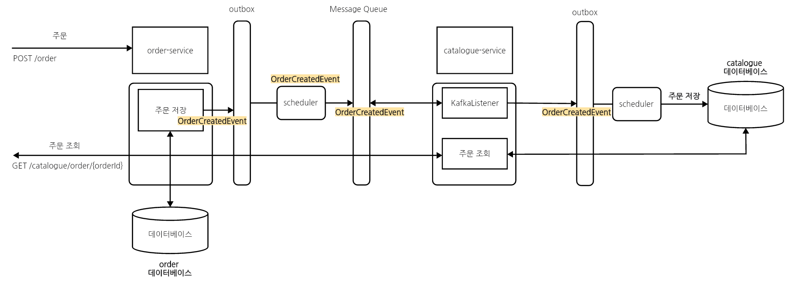
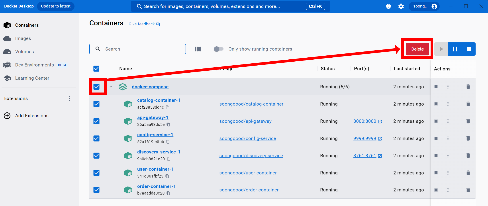
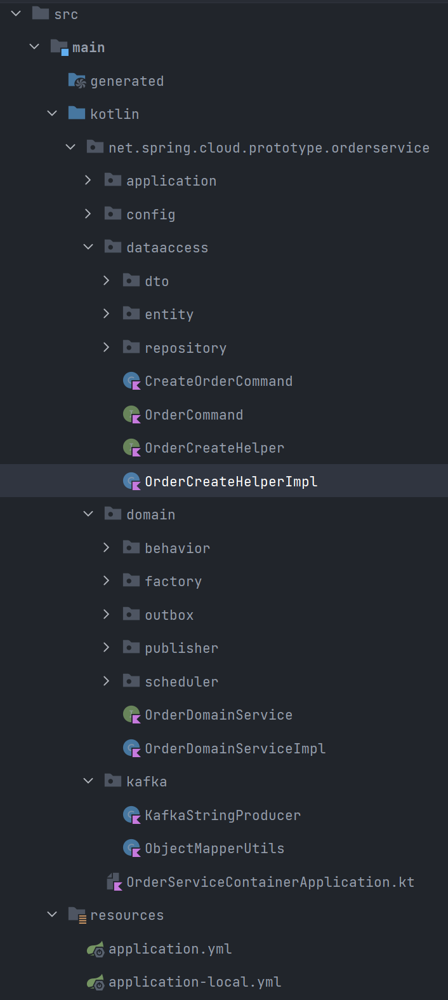
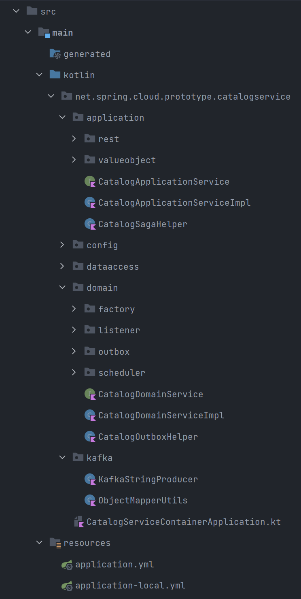
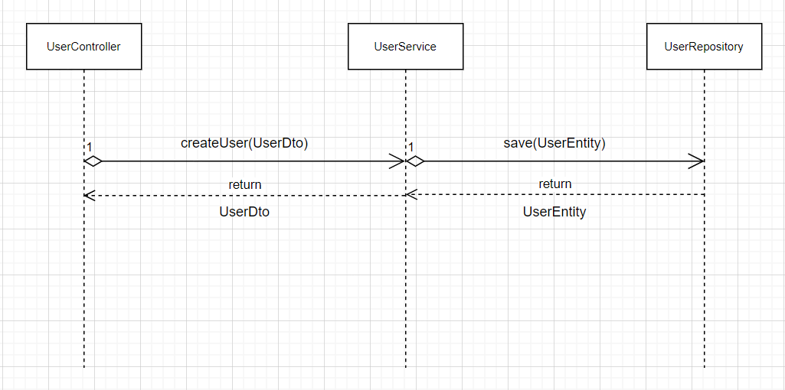
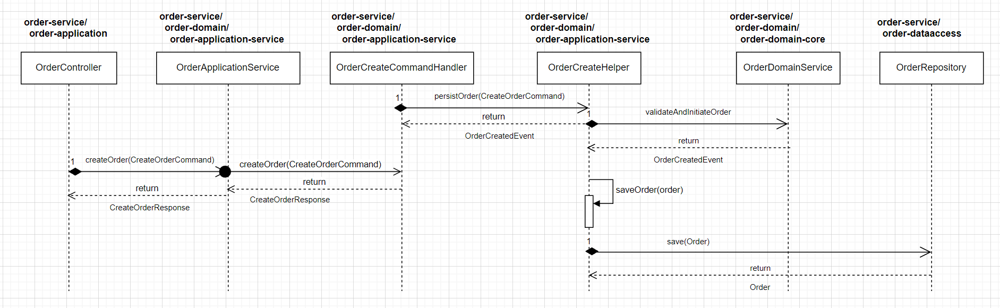

## EDA (Event Driven Architecture) 기반 Spring Cloud 예제

> 10월 말 \~ 11월 중순에 코딩테스트, 인적성 시험 전형이 있었는데 이 과정에 전형 준비를 해야 하는 관계로 인해 잠시 작업을 멈춰두게 되었고 오늘 부터 다시 작업을 시작 중입니다. 11월 23일 내로 기능을 완성할 것 같고 기능확인, 테스트코드에 대한 내용들을 정리할 수 있을 것으로 보입니다.

<br>


### 사용기술

- Kotlin, Spring Boot, Gradle(Kotlin DSL), JPA, Kafka, Docker, Docker Compose, Testcontainers, MySQL
- Gradle 멀티모듈 기반으로 주문서비스, 조회서비스, 사용자 서비스를 구성한 프로젝트입니다.
- Database 에 데이터를 저장/수정/삭제 등의 Domain Event 가 발생할 때 생성된 Domain Event 객체를 메시지 큐를 통해 주문서비스, 조회서비스,사용자서비스 간에 통신하고, Domain Event 를 통한 데이터 동기화를 수행합니다.
- 이 프로젝트의 가장 기초 골격이 되는 아이디어는 [Microservices: Clean Architector, DDD, SAGA, Outbox & Kafka](https://www.udemy.com/course/microservices-clean-architecture-ddd-saga-outbox-kafka-kubernetes/) 에서 얻어왔습니다.
- [Spring Cloud로 개발하는 마이크로서비스 애플리케이션(MSA)](https://www.inflearn.com/course/스프링-클라우드-마이크로서비스/dashboard) 의 예제를 조금 개선해보려다가 DDD 기반으로 전환하겠다!! 하는 마음을 먹고 나서 일이 이렇게까지 커졌는데... 빠른 시일안에 마무리 지어야 할 것 같다는...생각을 하는 중입니다.
- 원래 정말 제대로 하면 Outbox에 도메인 이벤트 데이터를 쌓아두는 것 역시도 비동기적으로 수행해야 하는데 이 부분에 대해서는 생략했습니다.

<br>


### 완료된 부분 (2023.10)

현재 User Container 와 여기에 따르는 Api Gateway 에서의 회원가입, 로그인 처리, 로컬 카프카 클러스터 도커 컴포즈 세팅작업까지 완료되어 있습니다. 회원가입, 로그인 시 사용한 인증 방식은 JWT 기반 Spring Security 방식입니다. RestDocs 또는 Swagger 를 적용해야 하는데, 이 부분은 Order Service, CatalogService  작업이 마무리 된 후 작업할 예정입니다.<br>

<br>


> **완료된 부분**<br>

- Api Gateway → User Container 
- User Container : 회원가입, JWT 로그인, 인증 (Spring Security)
- 로컬 카프카 docker-compose
  - 클러스터 3기, 주키퍼 1기, 카프카 매니저 1기 

<br>


> User Service 의 로그인, JWT 기능 확인방식에 대해서는 [개발문서 - User Service 기능확인](https://github.com/chagchagchag/eda-based-spring-cloud/blob/main/docs/%EA%B0%9C%EB%B0%9C%EB%AC%B8%EC%84%9C-User%20Service%20%EA%B8%B0%EB%8A%A5%20%ED%99%95%EC%9D%B8.md) 에 정리해두었습니다.

<br>


### 현재 진행중인 개발 내용 (2023.11\~)

> 10월 말 \~ 11월 초에 코딩테스트, 인적성 시험 전형이 있었고 시험공부, 코딩테스트로 인한 수면부족으로 인해... 11월 중순까지 번아웃 + 슬럼프 + 신체리듬 후폭풍을 겪으며 조금 쉬다가 구현을 시작했었는데, 우여곡절 끝에 기본적인 기능들을 모두 완료된 상태입니다. <br>
>
> 지금 현재는 테스트 코드 작성을 통해 코드 구조전환을 하거나 에러 검출 등의 작업을 하고 있습니다. <br>
>
> 다만, 테스트 코드 작성 중에 잠시 멈추고 통합테스트를 위해 별도의 wiremock 테스트를 하기 위한 기능을 스터디 중 입니다. 수동테스트(카프카 띄워두고 콘솔컨슈머로 데이터 연동여부 확인 등 모든 기능을 수작업으로 테스트)하는 과정을 거치는 것을 개발 완료로 간주했을 때 아마도 12월 중순...쿨럭.... 이때 쯤 모든 기능이 완료될 듯 합니다.ㅠㅠ<br>
>
> 개발 문서들(ERD, 시퀀스 다이어그램, 플로우차트) 공개는 조금 나중에 하게 될 듯 합니다.<br>

<br>


#### 아키텍처

Order Service (주문서비스) 와 Catalogue Service(조회 서비스) 간의 데이터 동기화를 SAGA, Outbox 방식으로 풀어내는 작업을 하고 있습니다. 예를 들면 아래와 같은 구조입니다.



<br>


주문 (POST /order) → Order 데이터베이스 → Outbox 에 저장 

- 사용자로부터 주문 저장 요청이 발생합니다. Order Service 는 이 데이터를 Order Service 가 바라보는 order 데이터베이스에 저장함과 동시에 `OrderCreatedEvent` 이벤트 객체를 생성합니다. 이렇게 생성된 이벤트를 보통 EDA 쪽의 용어에서는 도메인 이벤트라고 이야기합니다. 이렇게 생성된 이벤트 객체는 Outbox 에 저장해둡니다.

<br>


Order Service → MessageQueue

- OrderService에서 주문을 저장하는 연산은 `OrderCreatedEvent` 라는 도메인 이벤트를 발생시킵니다. 이렇게 발생된 도메인 이벤트는 메시지큐(e.g. Kafka, RabbitMQ) 에 전달됩니다. 
- 이렇게 메시지 큐에 전달하기 전에는 OrderService 내의 outbox 에 도메인 이벤트의 SAGA ID, SagaStatus, OutboxStatus 와 Event 의 내용을 저장하는 연산을 수행합니다.
- 그리고 이렇게 저장된 이벤트는 Scheduler 를 통해 일정 주기마다 한번씩 Batch 기반 전송 방식으로 메시지 큐에 전달합니다. (이번 예제에서는 단건 전송방식으로 구현합니다.)

<br>


Message Queue → Catalogue Service

- Catalogue Service 는 Kafka Listener 를 통해 메시지 큐의 메시지를 지속적으로 체크해서 수신합니다. 그리고 Kafka Listener 를 통해서 전달받은 이벤트 데이터를 수신한 즉시 outbox 에 저장합니다.

<br>


Scheduler(Catalogue Service) → Catalogue 데이터베이스

- 스케쥴러는 저장된 이벤트를 주기적으로 인출해서 Catalogue 데이터베이스에 데이터를 저장합니다.

<br>


주문데이터 조회

- 사용자는 /catalogue/order/{orderId}  API 를 접근해서 주문데이터를 조회하는데, 이때 조회하는 데이터는 catalogue-service 가 스케쥴러 기반으로 업데이트한 데이터베이스의 데이터입니다.

<br>


흔히 메시지 큐 를 통해 도메인 이벤트를 전달하는 방식을 SAGA 라고 이야기하는 편이고, 도메인 안에서 발생한 이벤트를 Outbox라는 데이터베이스에 보관해두고 이벤트 트랜잭션의 ACID를 확보하는 것을 Outbox 라고 자주 이야기합니다.<br>

<br>


#### 참고해볼만한 자료들

제가 만드는 자료는 예제 정도의 범위로 SAGA, Outbox를 어떻게 구축하는지에 대한 큰 그림을 코드로 표현하는데에 목적이 있습니다. 혼자 EDA(Event Driven Architecture) 를 스터디할 때 참고했던 자료 또는 우연히 찾았지만 아직 읽지 않은 유용해보이는 자료들은 아래와 같습니다. 혹시라도 EDA에 대해 관심이 있지만 생소하시다면 참고해주셨으면 합니다.

- [Kafka Transaction](https://yangbongsoo.tistory.com/77)
- [Kafka 이벤트 발행과 DB 저장 (redis) 트랜잭션](https://yangbongsoo.tistory.com/83)
- [Event Driven Architecture](https://jaehun2841.github.io/2019/06/23/2019-06-23-event-driven-architecture/#Event-Driven-%EB%9E%80)
- [DDD - 이벤트란 무엇인가?! + 마이크로 서비스간 트랜잭션 처리](https://jaehoney.tistory.com/254)
- [당신의 MSA 는 안녕하신가요? MSA 를 보완하는 아키텍처 : EDM (Event Driven Microservice)](https://www.samsungsds.com/kr/insights/msa_architecture_edm.html)
- [Microservices: Clean Architector, DDD, SAGA, Outbox & Kafka](https://www.udemy.com/course/microservices-clean-architecture-ddd-saga-outbox-kafka-kubernetes/)
  - 이 강의에서 제공하는 예제와 강의자료에서 가르쳐주는 SAGA, Outbox 의 흐름을 직접 코드를 보고 파악한 후 조금은 더 단순화된 버전의 예제로 만들고 있습니다. 조금만 기다려주세요 흐흑..!!
- [Object Mapper](https://yangbongsoo.tistory.com/75)
- [Microservices Patterns](https://www.oreilly.com/library/view/microservices-patterns/9781617294549/)
  - 이 책이 유명하다고 하는데 아직은 읽어보지 못했습니다.......

<br>


### 2023.12 ~ 


#### 설계, 코드 구조, ERD

ERD 문서 작성 중...

<br>


### 빌드

모든 WAS 코드를 이미지 빌드하는 코드는 쉘스크립트로 작성해두었습니다.

도커이미지는 모두 도커허브에 최신버전의 빌드를 올려둔 상태이기에 소스 코드를 수정한 것이 아니라면 가급적 빌드를 안하시는 것을 권장드립니다. (개발PC 속도 저하문제)

```bash
cd docker-compose
source build-all-docker-image.sh
```


### 실행

> 도커 실행 환경 역시 추후 개선이 필요할 경우 수정을 할 예정입니다.


- 이 프로젝트는 로컬 개발환경에서는 Docker, Docker Compose 를 기반으로 구동합니다.
- 로컬에서 이 프로젝트를 실행시키시려면 아래의 명령어를 터미널에서 실행시켜주세요.
- (도커가 설치되어 있지 않다면 [Docker Desktop](https://www.docker.com/products/docker-desktop/) 을 설치해주세요.)

```bash
source local-build-all-docker-image.sh
```

<br>


실행된 도커 인스턴스를 정지 & 삭제하려면 `Docker Desktop` 에서 `docker-compose` 라는 이름으로 구동되는 도커컴포즈 스택을 선택해 체크한 후 상단의 `Delete` 버튼을 클릭해 중지시킵니다. 




### 소스 코드 파악

작성 초기에는 [Microservices: Clean Architector, DDD, SAGA, Outbox & Kafka](https://www.udemy.com/course/microservices-clean-architecture-ddd-saga-outbox-kafka-kubernetes/) 강의에서 제공하는 실습 예제는 ooo-application, ooo-container, ooo-dataaccess, ooo-domain, ooo-messaging 과 같은 모듈로 분리하는 방식의 구조입니다. 이번 예제 구현의 초창기에는 이 구조를 따르다가 얼마 전부터 그 정도로까지 세분화는 필요가 없어서 ooo-service 모듈/ooo-container 모듈과 같은 구조입니다.<br>


#### user-service 모듈

user-service 모듈에는 user-container 모듈이 존재합니다.

- [Microservices: Clean Architector, DDD, SAGA, Outbox & Kafka](https://www.udemy.com/course/microservices-clean-architecture-ddd-saga-outbox-kafka-kubernetes/) 에서 이야기하는 maven 멀티모듈 구조를  gradle kotlin 기반의 멀티 모듈로 작성했으나, user-service 모듈은 아직 구조를 ooo-service/ooo-container 구조로 단순하게 변경해두진 못해둔 상태입니다. 즉, 모듈 구조를 단순화하는 작업을 아직 해두지 않았습니다. (로그인, 회원가입, JWT 헤더 추가 등의 인증 기능은 정상동작합니다.)

<br>


#### order-service (루트프로젝트)

- order-container (모듈)
  - `net.spring.cloud.prototype.orderservice` (패키지)
  - /application
    - Rest Controller, RestController Advice, Parameter Validation 등 웹 계층의 역할 수행하는 계층
  - /dataaccess
    - 데이터 저장 및 Database 연산을 담당
    - 데이터의 변경 발생시 그에 해당되는 Domain Event 를 생성하도록 OrderDomainService 의 insertToOutbox()메서드를 호출
  - /domain
    - DomainEvent 생성 역할을 수행
    - outbox,scheduler,listener,publisher 를 통해 도메인 이벤트의 리스닝, 발신, 스케쥴링 역할을 담당
    - /outbox
      - outbox 패턴을 따르는 repository, entity 를 기술한 계층
    - /publisher
      - DomainEvent 의 전송 역할을 담당하는 Publisher들을 모아두는 계층
    - /scheduler
      - 일정 시간 간격으로 배치 사이즈에 맞게끔 outbox 테이블에서 필요한 만큼의 이벤트 리스트를 인출해서 메시지큐로 전송할 수 있도록 스케쥴링 해주는 역할을 담당
  - /kafka
    - 카프카 메시지 전송 등의 코드들을 컴포넌트 화 해둔 계층




<br>


#### catalog-service 모듈

catalog-container (모듈)

- `net.spring.cloud.prototype.catalogservice` (패키지)
- /application
  - Rest Controller, RestController Advice, Parameter Validation 등 웹 계층의 역할 수행하는 계층
- /dataaccess
  - 데이터 저장 및 Database 연산을 담당
  - 데이터의 변경 발생시 그에 해당되는 Domain Event 를 생성하도록 OrderDomainService 의 insertToOutbox()메서드를 호출
- /domain
  - DomainEvent 생성 역할을 수행
  - outbox,scheduler,listener,publisher 를 통해 도메인 이벤트의 리스닝, 발신, 스케쥴링 역할을 담당
  - /outbox
    - outbox 패턴을 따르는 repository, entity 를 기술한 계층
  - /publisher
    - DomainEvent 의 전송 역할을 담당하는 Publisher들을 모아두는 계층
  - /scheduler
    - 일정 시간 간격으로 배치 사이즈에 맞게끔 outbox 테이블에서 필요한 만큼의 이벤트 리스트를 인출해서 메시지큐로 전송할 수 있도록 스케쥴링 해주는 역할을 담당
- /kafka
  - 카프카 메시지 전송 등의 코드들을 컴포넌트 화 해둔 계층

<br>



<br>


#### 자주 사용된 코드 작성 원칙

##### 프록시 객체

프록시 객체 개념을 소스코드 전반적으로 굉장히 많이 했습니다. 순환참조, 기능 수정시 raw 레벨 기능 수정 방지 등을 목적으로 프록시 역할의 객체를 통해 기능에 접근하도록 대부분의 기능을 정의했습니다.<br>

프록시 객체를 정의할 때 사람에 따라 `-Agent`, `-Helper` 라는 접미사를 붙여서 클래스명을 사용하는데, 저의 경우 모든 프록시 객체를 `-Helper` 라는 접미사를 사용하는 것으로 통일했습니다. <br>

실제 작성한 코드들 대부분은 대리인을 통해 raw 레벨의 기능을 호출하는 구조이지만, 일반적인 다른 Java 라이브러리 들에서 `-Agent` 라는 클래스가 많을것 같아 혼동을 야기할 것 같아서 `-Helper` 라는 접미사로 통일했습니다.<br>

간단하게 예를 들면 아래와 같은 코드입니다.<br>

```kotlin
@Service
class CatalogDomainServiceImpl (
    val catalogOutboxRepositoryHelper: CatalogOutboxRepositoryHelper,
    val orderCreatedEventFactory: OrderCreatedEventFactory,
): CatalogDomainService {

    @Transactional
    override fun persistOrderCreatedEvent(eventString: String) {
        val orderCreatedEvent = orderCreatedEventFactory.fromEventString(eventString)
        val catalogOutboxEntity = orderCreatedEventFactory.toOutboxEntity(orderCreatedEvent)
        catalogOutboxRepositoryHelper.save(catalogOutboxEntity)
    }

}
```

<br>


CatalogDomainServiceImpl 에서 CatalogOutboxRepository 에 OrderCreatedEvent 를 저장하려고 하는데, 이때 아래의 원칙을 통해 CatalogOutboxRepository에 직접 접근하지 않고 CatalogOutboxRepositoryHelper 에게 요청을 합니다.

- "CatalogOutboxRepository의 save() 가 필요해? 그럼 CatalogOutboxRepositoryHelper에게 save() 를 요청해"

<br>

이렇게 하면 CatalogOutboxRepository 에서 SQL 변경사항이 발생하더라도 CatalogDomainServiceImpl 객체에까지 변경사항이 전파되지는 않습니다. CatalogOutboxRepository 에서 변경사항이 발생하면 CatalogOutboxRepositoryHelper 의 해당 내용만 수정하면 되기 때문입니다.<br>

그리고 프로젝트의 규모가 커지면 커질 수록 새로운 기능 추가 등을 거칠때 순환참조 의존성 문제가 빈번하게 발생하고 이런 문제로 인해 3000줄이 넘는 레거시 코드가 발생하기도 합니다. 이런 증상을 해결하려면 raw 레벨(low(x))의 코드를 감싸는 Wrapper 역할을 하는 프록시 객체를 통해 협상을 하도록 하는 것이 필요합니다.<br>

요약하자면 아래의 두 이유로 인해 이번 사이드 프로젝트 전반적으로 프록시 객체를 기반으로 한 코드를 많이 작성했습니다. 그리고 대부분의 프록시 객체는 `-Helper` 라는 접미사를 가지도록 이름을 통일했습니다.

- 기능의 강결합 문제
- 순환 참조 의존성 문제

<br>


##### 생각날 때마다 추가!!! 

<br>


### 포트 사용 현황

#### infrastructure/docker-compose (kafka)
- 2181 : zookeeper
- 8081 : schema registry
    - depends_on : broker1, broker2, broker3
- 19092 : broker1
- 29092 : broker2
- 39092 : broker3
- 9000 : kafka-manager

<br>


#### spring-cloud/discovery-server
- 8761

#### spring-cloud/api-gateway
- 8000

#### spring-cloud/config-server
- 9999

#### user-service/user-container
- 기본적으로 애플리케이션 인스턴스는 모두 random.port 기반으로 하고 Eureka Server(Discovery Server) 로부터 fqdn(프로토콜:서버주소:포트)을 얻어오도록 규칙을 정함<br>


#### order-service/order-container
- 기본적으로 애플리케이션 인스턴스는 모두 random.port 기반으로 하고 Eureka Server(Discovery Server) 로부터 fqdn(프로토콜:서버주소:포트)을 얻어오도록 규칙을 정함<br>


#### catalog-service/catalog-container
- 기본적으로 애플리케이션 인스턴스는 모두 random.port 기반으로 하고 Eureka Server(Discovery Server) 로부터 fqdn(프로토콜:서버주소:포트)을 얻어오도록 규칙을 정함<br>


### 이 예제 프로젝트의 목적

아래 내용들은 다시 수정 예정 흑흑...


[CleanArchitecture, DDD](https://www.udemy.com/course/microservices-clean-architecture-ddd-saga-outbox-kafka-kubernetes/) 에서 제공하는 SAGA, Outbox 기반의 멀티모듈 방식과

[Spring Cloud로 개발하는 마이크로서비스 애플리케이션(MSA)](https://www.inflearn.com/course/%EC%8A%A4%ED%94%84%EB%A7%81-%ED%81%B4%EB%9D%BC%EC%9A%B0%EB%93%9C-%EB%A7%88%EC%9D%B4%ED%81%AC%EB%A1%9C%EC%84%9C%EB%B9%84%EC%8A%A4/dashboard) 에서 제공하는 Spring Cloud 적용방식을 

조합한 예제를 만드는 것이 목적

<br>


예를 들면 [Spring Cloud로 개발하는 마이크로서비스 애플리케이션(MSA)](https://www.inflearn.com/course/%EC%8A%A4%ED%94%84%EB%A7%81-%ED%81%B4%EB%9D%BC%EC%9A%B0%EB%93%9C-%EB%A7%88%EC%9D%B4%ED%81%AC%EB%A1%9C%EC%84%9C%EB%B9%84%EC%8A%A4/dashboard) 에서 사용자 추가를 하는 로직의 흐름은 아래와 같습니다. 



Spring Cloud 를 어떻게 사용하는지에 대한 레시피 성격의 강의이기에 굉장히 짧은 예제로 직관적으로 설명합니다. 다만, Mapper 관련 로직들도 대부분 컨트롤러에 하드코딩 되는 등 테스트코드를 작성하거나 테스트 가능한(Testable) 구조는 아닙니다. 당연히 레시피 용도의 코드는 실무 적용시에는 응용이 필요한 예제입니다.

<br>


아래의 경우는 [CleanArchitecture, DDD](https://www.udemy.com/course/microservices-clean-architecture-ddd-saga-outbox-kafka-kubernetes/) 에서 제공하는 음식주문시스템에서 주문을 내릴 때의 구조입니다.



멀티 모듈 기반으로 구성되어있으며, Command 를 통해 Domain 에 메시지(객체의 함수)를 호출하고, 그 이후의 처리는 `OrerCreatedEvent` 라는 이벤트 기반의 처리를 합니다. 위의 그림에서 persistOrder(CreateOrderCommand) 내에서 `validateAndInitiateOrder()` 메서드 호출 이후에도 다른 동작을 수행하는데, 이 동작들은 지면상 생략을 해두었습니다.<br>

<br>


이 리포지터리에서 정리하는 예제는 이런 내용입니다. Spring Cloud 를 기반으로 SAGA, Outbox 를 직접 구현해서 예제로 만들어둡니다.<br>

<br>


### API

> 흑... swagger 를 조만간 도입할 예정!!!

#### user-container

`user-container` 의 경우 REST API 규격을 맞춰서 자원의 행위(Method)를 HTTP Method 로 표현하는 겻이 정석적인 표현이긴 하지만,<br>

사용자의 회원가입, 로그인 등에 이런 행위를 끼워맞추는 것이 부자연스러워 보이기에 불가피하게 아래와 같이 `/welcome`, `/signup`, `/login`, `/logout` 등의 독립적인 URL 을 가지도록 지정했습니다.<br>


- GET `/welcome`
- POST `/signup`
- POST `/login`
- GET `/users/{userId}`

<br>


#### order-container

현재 Kafka Connect 도커설정 + Order Container, Catalog Container, 카프카 토픽 설정 작업을 하다가 중지했습니다.

개인적인 일정으로 인해 10/18 이 후에 작업 예정입니다.<br>

<br>


#### catalog-container

현재 Kafka Connect 도커설정 + Order Container, Catalog Container, 카프카 토픽 설정 작업을 하다가 중지했습니다.

개인적인 일정으로 인해 10/18 이 후에 작업 예정입니다.<br>

<br>

