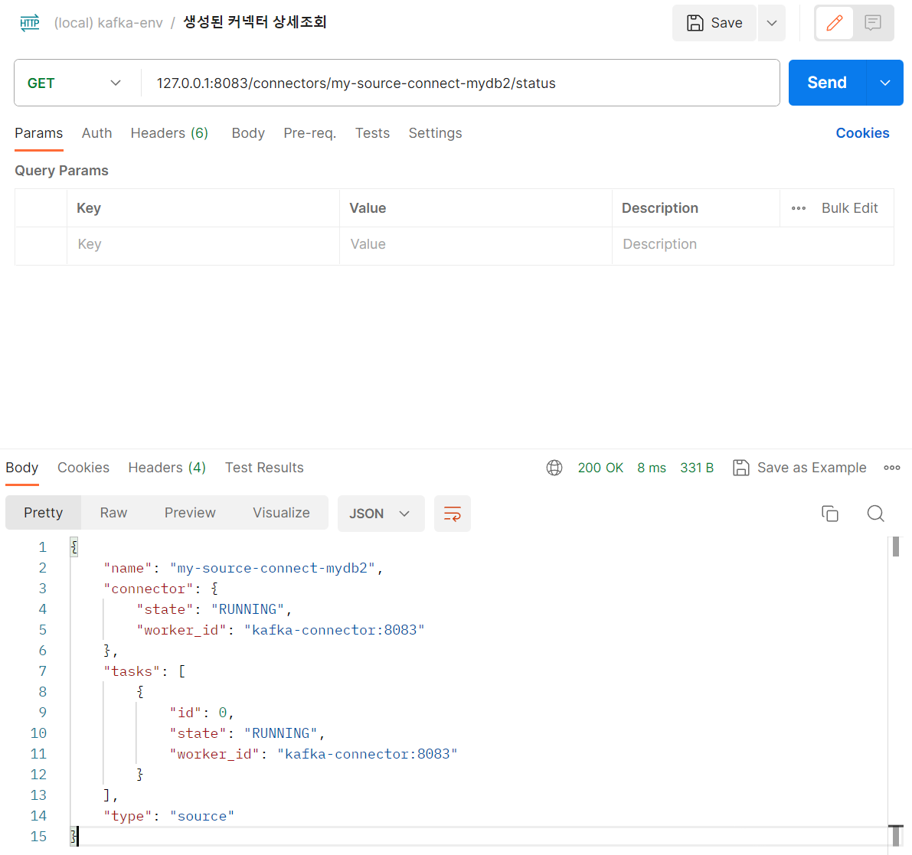

## docker 기반 kafka connector 에 새로운 커넥터 연동 (e.g. JdbcSinkConnector, JdbcSourceConnector)

처음 docdocker 기반으로 설치한 kafka-connector 의 베이스 이미지인 [confluentinc/cp-kafka-connect](https://hub.docker.com/r/confluentinc/cp-kafka-connect) 이미지에는 사용할 만한 커넥터가 없다. 따라서 뭔가 새로운 커넥터가 필요할 때마다 jar 파일을 프로젝트 내에 특정 디렉터리에 볼륨으로 마운트를 시켜줘야 한다. 오늘 이 문서에서는 새로운 커넥터 jar 를 [confluentinc/cp-kafka-connect](https://hub.docker.com/r/confluentinc/cp-kafka-connect) 이미지 기반의 컨테이너에 볼륨으로 마운트 시켜주는 과정을 정리해봤다.

<br>


### JdbcConnector 설치 확인

confluentinc/cp-kafka-connect 이미지를 사용중이라면, confluent/cp-kafka-connect 이미지의 구동을 하기 시작한 초기 이미지 내에  JdbcConnector 가 설치되어 있지 않다. 혹시 모르니 아래와 같이 브라우저에 [http://localhost:8083/connector-plugins](http://localhost:8083/connector-plugins) 로 접속해서 내가 설치한 kafka-connect 도커이미지에 JdbcConnector 가 설치되어 있는지 확인하자.

캡처화면을 보면 JdbcConnector 는 설치되지 않은 상태임을 확인할 수 있다.


### JdbcConnector 다운로드

[https://www.confluent.io/hub/](https://www.confluent.io/hub/) 에 접속해서 JdbcConnector 를 검색한다. JDBC Connector (Source and Sink) 가 추천으로 나타나는데 이것을 선택한다.


<br>


새로 나타난 [JDBC Connector (Source and Sink)](https://www.confluent.io/hub/confluentinc/kafka-connect-jdbc) 에서 다운로드 버튼을 눌러서 다운로드 받는다.


<br>


### 도커 이미지에 다운로드 받은 jar 파일을 연결

먼저 위에서 다운로드 받은 zip 파일을 압축을 풀어서 압축을 푼 디렉터리 내의 lib 디렉터리를 살펴보면 아래와 같다.


나는 이 파일들을 프로젝트 디렉터리 내의 `docker-compose/kafka/kafka-connect/connectors` 디렉터리에 이 jar 파일들을 컨테이너의 볼륨으로 마운트시켜주기로 했다.

```yaml
version: '3.7'
services:
	kafka-connector:
  	image: confluentinc/cp-kafka-connect:${KAFKA_VERSION}
    container_name: kafka-connector
    ports:
      - 8083:8083
    environment:
    	# ... (중략)
    volumes:
    	- "./kafka-connect/connectors:/etc/kafka-connect/jars"
    networks:
      - ${GLOBAL_NETWORK:-kafka}
```

만약 프로젝트 내에 원하는 디렉터리가 없다면 새로 생성해주거나 마음에 드는 디렉터리를 따로 지정해주고 싶다면 `kafka-connector` 이미지의 `volumes` 항목내의 경로를

```yaml
services:
	kafka-connector:
		# ...
		volumes:
    	- "./kafka-connect/connectors:/etc/kafka-connect/jars"
```

아래와 같이 수정해준다.

```yaml
services:
	kafka-connector:
		# ...
		volumes:
    	- "./{프로젝트 내 원하는 디렉터리}:/etc/kafka-connect/jars"
```


그리고 위에서 지정해준 파일들을 프로젝트 내의 `docker-compose/kafka/connectors` 내에 복사해줬다.


<br>


### jdbc driver 를 kafka-connect 에 연결

처음 docdocker 기반으로 설치한 kafka-connector 의 베이스 이미지인 [confluentinc/cp-kafka-connect](https://hub.docker.com/r/confluentinc/cp-kafka-connect) 이미지에는 mysql jdbc driver 역시 없기 때문에 직접 수작업으로 jdbc-driver jar 파일을 연결해줘야 한다.<br>

내 경우 mysql 을 연동하는 것이 목적이다. 따라서 [mysql-connector jar 파일](https://mvnrepository.com/artifact/com.mysql/mysql-connector-j/8.1.0)을 다운로드 받아서 위에서 지정했던 디렉터리인 `docker-compose/kafka/connectors` 에 복사해줬다.<br>


<br>


### 카프카 재기동 후 kafka-connect에 JdbcConnector 가 제대로 연동되었는지 확인

브라우저에 [http://localhost:8083/connector-plugins](http://localhost:8083/connector-plugins) 을 입력해서 접속해보면 아래 그림에서 보듯 JdbcSinkConnector, JdbcSourceConnector 가 정상적으로 연동되었음을 확인 가능하다.


<br>


## 실습용 테이블, MySQL 권한설정

### 테이블 생성 

```sql
create table users
(
    id         int auto_increment
        primary key,
    user_id    varchar(20)                        not null,
    pwd        varchar(20)                        not null,
    name       varchar(20)                        not null,
    created_at datetime default CURRENT_TIMESTAMP null
);
```


### 권한 추가

권한이 부족해서 안되는 경우가 있는데 특정 호스트에서의 특정 테이블로의 접근 권한을 업데이트 해줘야 한다. 개발환경에서 하는 것이기에 아래와 같이 입력해줬다.

```sql
 GRANT ALL PRIVILEGES ON root.* TO 'root'@'%' IDENTIFIED BY 'test1357' WITH GRANT OPTION;
 flush previleges;
```


참고

- https://java119.tistory.com/61
- https://wecandev.tistory.com/110
- https://m.blog.naver.com/PostView.naver?isHttpsRedirect=true&blogId=iopqwas&logNo=140149503159


### mysql docker-compose

```yaml
version: '3.7'
services:
  mysql-user-service:
    image: mysql:5.7.39-debian
    restart: always
    container_name: mysql-user-service
    hostname: mysql-user-service
    networks:
      - kafka_msa-prototype # kafka-cluster 생성시 생성된 network. docker network ls 로 조회 가능.
    ports:
      - "3306:3306"
    environment:
      - MYSQL_USER=user
      - MYSQL_USER_HOST=%
      - MYSQL_PASSWORD=test1357
      - MYSQL_DATABASE=my_db
      - MYSQL_ROOT_HOST=%
      - MYSQL_ROOT_PASSWORD=test1357
      - TZ=Asia/Seoul
    command:
      - --character-set-server=utf8mb4
      - --collation-server=utf8mb4_unicode_ci
    volumes:
      - ./init/:/docker-entrypoint-initdb.d/
networks:
  kafka_msa-prototype:
    external: true
```

<br>


### sql 초기화 스크립트

같은 디렉터리 내에 `init/` 디렉터리를 생성하고 이곳에 아래의 sql 파일을 만들어두었다.

`./init/init.sql`

```sql
GRANT ALL PRIVILEGES ON root.* TO 'root'@'%' IDENTIFIED BY 'test1357' WITH GRANT OPTION;
flush privileges;


create table users
(
    id         int auto_increment
        primary key,
    user_id    varchar(20)                        not null,
    pwd        varchar(20)                        not null,
    name       varchar(20)                        not null,
    created_at datetime default CURRENT_TIMESTAMP null
);
```

<br>


## 트러블 슈팅 (1) : network 설정 

위에서는 kafka-connect → mysql 로 접속할 때 아래와 같이 `mysql-user-service` 라는 호스트명을 그대로 입력해줬다. 

```json
{
	"name": "my-source-connect-mydb2",
	"config": {
		"connector.class": "io.confluent.connect.jdbc.JdbcSourceConnector",
		"connection.url": "jdbc:mysql://mysql-user-service:3306/my_db",
		"connection.user": "root",
		"connection.password": "test1357",
		"mode": "incrementing",
		"incrementing.column.name": "id",
		"table.whitelist": "users",
		"topic.prefix": "my_topic_",
		"tasks.max": "1"
	}
}
```


`kafka` 의 docker-compose와 `mysql`의 docker-compose가 서로 다른 컴포즈에서 실행되기에 초기에 이 부분이 연결되도록 하느라 애를 먹었는데 docker-compose 내의 network를 아래와 같이 지정해줬다.

<br>


### kafka 측의 설정

common.yml

```yaml 
version: '3.7'

networks:
  msa-prototype:
    driver: bridge
```

<br>


kafka_cluster.yml

```yaml
version: '3.7'
services:
  schema-registry:
		# ... 중략 
    networks:
      - ${GLOBAL_NETWORK:-kafka}
  kafka-connector:
    # ... 중략
    networks:
      - ${GLOBAL_NETWORK:-kafka}
  kafka-broker-1:
    # ... 중략
    networks:
      - ${GLOBAL_NETWORK:-kafka}
  kafka-broker-2:
    # ... 중략
    networks:
      - ${GLOBAL_NETWORK:-kafka}
  kafka-broker-3:
    # ... 중략
    networks:
      - ${GLOBAL_NETWORK:-kafka}
  kafka-manager:
    # ... 중략
    networks:
      - ${GLOBAL_NETWORK:-kafka}
```

<br>


### mysql 측의 설정

기존에 존재하는 네트워크를 사용하도록 `external: true` 를 지정해줬다.

- 참고자료
  - [https://great-developer.tistory.com/289](https://great-developer.tistory.com/289)
  - https://velog.io/@lijahong/0%EB%B6%80%ED%84%B0-%EC%8B%9C%EC%9E%91%ED%95%98%EB%8A%94-Docker-%EA%B3%B5%EB%B6%80-Docker-Compose-Network-Volume-%EC%A0%95%EC%9D%98%ED%95%98%EA%B8%B0
  - https://developer-eun-diary.tistory.com/145

```yaml
version: '3.7'
services:
  mysql-user-service:
    image: mysql:5.7.39-debian
    # 중략 ... 
    volumes:
      - ./volumes/init/:/docker-entrypoint-initdb.d/
networks:
  kafka_msa-prototype:
    external: true
```

<br>


## Source Connector 실습

### Connect 생성 Post 요청 

[127.0.0.1:8083/connectors](127.0.0.1:8083/connectors) 에 POST 요청을 보냈다.

RequestBody 는 아래와 같다. curl 로 요청을 보내려고 했는데, 파일로도 기록을 남겨두는게 필요해서 그냥 아래 파라미터를 그대로 따라서 Postman 에서 실행했다.

```json
{
	"name": "my-source-connect-mydb2",
	"config": {
		"connector.class": "io.confluent.connect.jdbc.JdbcSourceConnector",
		"connection.url": "jdbc:mysql://mysql-user-service:3306/my_db",
		"connection.user": "root",
		"connection.password": "test1357",
		"mode": "incrementing",
		"incrementing.column.name": "id",
		"table.whitelist": "users",
		"topic.prefix": "my_topic_",
		"tasks.max": "1"
	}
}
```


Postman 에서 실행한 결과는 아래와 같다. `my-source-connect-mydb2` 라는 이름으로 정상적으로 생성되었다.


<br>


### 생성한 커넥터(connector)들의 목록 확인

[127.0.0.1:8083/connectors](127.0.0.1:8083/connectors) 에 GET 요청을 해서 확인해보면, 방금 추가했던 `my-source-connect-mydb2` 라는 커넥터가 나타나는 것을 확인 가능하다.


<br>


### 생성한 커넥터의 상세정보 조회

[127.0.0.1:8083/connectors/my-source-connect-mydb2/status](http://127.0.0.1:8083/connectors/my-source-connect-mydb2/status) 에 접속해서 현재 connect 의 상태를 확인해보자.

정상적으로 나타난다.



<br>


### DB 테이블 내에 데이터 INSERT 전/후에 따라 topic 의 변화 확인하기

kafka-broker-1 접속

```bash
$ docker exec -it kafka-broker-1 bash
[appuser@kafka-broker-1 ~]$ cd /usr/bin
```

<br>


토픽 리스트 조회

```bash
[appuser@kafka-broker-1 bin]$ kafka-topics --list --bootstrap-server kafka-broker-1:9092
__consumer_offsets
_schemas
quickstart-avro-config
quickstart-avro-offsets
quickstart-avro-status
```

<br>


아직은 별다른 토픽들이 존재하지 않는다. `quickstart-avro-*` 은 모두 내가 직접 다른 용도로 만들어둔 토픽들이다.<br>


이제 테이블에 데이터를 INSERT 해보자.


<BR>


INSERT 를 한 이후의 토픽의 변화를 확인해보면 아래와 같다.

`my_topic_users` 토픽이 생성되었음을 확인가능하다.

```bash
[appuser@kafka-broker-1 bin]$ kafka-topics --list --bootstrap-server kafka-broker-1:9092
__consumer_offsets
_schemas
my_topic_users
quickstart-avro-config
quickstart-avro-offsets
quickstart-avro-status
```

<br>


### 데이터 insert 시 마다 topic의 데이터를 console-consumer로 읽어보기

이번에는 consumer 로 데이터 insert 시마다 생성되는 토픽의 데이터를 읽어들여보자.

먼저 터미널을 새로 열어서 `kafka-broker-1` 에 bash 접속하자.

```bash
$ docker exec -it kafka-broker-1 bash
[appuser@kafka-broker-1 ~]$ cd /usr/bin/
```

<br>


kafka-console-consumer 를 이용해서 kafka-broker-1 의 `my_topic_users` 토픽을 구독하는 CLI를 아래와 같이 작성한다.

```bash
[appuser@kafka-broker-1 bin]$ kafka-console-consumer --topic my_topic_users --bootstrap-server kafka-broker-1:9092 --from-beginning
```

<br>


그리고 다른 창에서는 아래와 같이 데이터를 insert 해본다.


<br>


데이터를 insert 함과 동시에 kafka-console-consumer 에서는 아래와 같은 화면이 나타난다.

추가된 데이터가 topic에 전달되어 console-consumer도 이 데이터를 읽어들인 후 데이터를 화면에 출력하게 된다.


<br>


추가된 토픽 데이터를 json formatter 를 통해 정렬해서 데이터의 구조를 확인해보면 아래와 같다.

```json
{
    "schema":{
        "type":"struct",
        "fields":[
            {
                "type":"int32",
                "optional":false,
                "field":"id"
            },
            {
                "type":"string",
                "optional":false,
                "field":"user_id"
            },
            {
                "type":"string",
                "optional":false,
                "field":"pwd"
            },
            {
                "type":"string",
                "optional":false,
                "field":"name"
            },
            {
                "type":"int64",
                "optional":true,
                "name":"org.apache.kafka.connect.data.Timestamp",
                "version":1,
                "field":"created_at"
            }
        ],
        "optional":false,
        "name":"users"
    },
    "payload":{
        "id":3,
        "user_id":"3",
        "pwd":"3333",
        "name":"three",
        "created_at":1698288944000
    }
}
```

<br>


## Sink Connector 실습

앞서 Source Connector 에서는 테이블에 데이터를 저장할 때 토픽에 데이터가 적재되는 것을 확인했었다. Source Connector 는 이렇게 데이터 소스(테이블, csv파일 등)의 변화를 토픽에 적재한다.<br>

Sink Connector 는 토픽에 데이터가 추가될 때마다 원하는 테이블에 데이터가 저장되는 것을 확인한다. ~~그런데 Sink Connector 는 여기에 더해서 Sink Connector 가 바라보는 테이블에 데이터가 추가될 때마다 Sync Connector 토픽에도 데이터가 적재된다. `Sync Connector 실습` 에서는 이 실습 과정을 정리해두기로 했다.~~<br>

<br>


### Source Connector 실습에서는 이런 것들을 했었다.

users 테이블 데이터 INSERT <br>

  → Source 커넥터가 데이터를 `my_topic_users` 토픽에 적재 <br>

  → kafka-console-consumer 로 `my_topic_users` 토픽을 구독해서 데이터 확인<br>

users 테이블에 데이터를 INSERT 한 후에 데이터가 테이블에 저장이 되면, Source 커넥터는 이것을 읽어들여서 my_topic_users 토픽에 적재했다. 그리고 my_topic_users 토픽을 구독하는 kafka-console-consumer 에서 이 데이터를 받아서 확인할수 있었다.<br>

<br>


### Sink Connector 실습에서는 무엇을 할까?

기본적으로 Sink Connector 는 자신이 감시하는 토픽을 지속적으로 바라보고 있다가 토픽에 데이터가 추가되면 커넥터에 지정해둔 테이블에 해당 데이터를 저장하는 역할을 수행한다. 즉, sink 커넥터는 자신의 토픽에 데이터가 추가되면 토픽 테이블에 데이터를 저장하는 역할을 수행한다. 

Sink Connector 실습에서 데이터를 추가하게 되는 경로는 두가지 경로다. 

첫번째는 Source 커넥터를 통해 users 테이블에 데이터를 추가하면서 Source 커넥터가  my_topic_users 토픽에 데이터가 추가하는 경우다. 이때 my_topic_users 를 바라보는 싱크 커넥터는 데이터가 추가되었음을 감지해서 `my_db.my_topic_users` 테이블에 데이터를 저장하게 된다.<br>


두번째 경우는 `my_topic_users` 토픽에만 별도로 데이터가 추가되었을 때 싱크커넥터가 `my_db.my_topic_users` 에 데이터를 추가하는 경우다.<br>


<br>


### 새로 생성되는 테이블의 스키마 구조는 어떻게 구성될까?

Sink Connector 내에 지정해둔 타겟 테이블은 Sink Connector 가 바라보고 있는 토픽에 전달되는 데이터의 형식에 맞게끔 테이블이 생성된다. 예를 들면 토픽에 전달되는 데이터가 아래와 같은 형식이면 avro 등의 라이브러리 등에 의해 내부적인 형식에 맞게끔 테이블이 구성된다. 이때 토픽이 바라보는 테이블이 DB에 존재하지 않으면 새로 생성된다.

```json
{
    "schema":{
        "type":"struct",
        "fields":[
            {
                "type":"int32",
                "optional":false,
                "field":"id"
            },
            {
                "type":"string",
                "optional":false,
                "field":"user_id"
            },
            {
                "type":"string",
                "optional":false,
                "field":"pwd"
            },
            {
                "type":"string",
                "optional":false,
                "field":"name"
            },
            {
                "type":"int64",
                "optional":true,
                "name":"org.apache.kafka.connect.data.Timestamp",
                "version":1,
                "field":"created_at"
            }
        ],
        "optional":false,
        "name":"users"
    },
    "payload":{
        "id":100,
        "user_id":"100",
        "pwd":"100100100",
        "name":"hundred",
        "created_at":1698288163000
    }
}
```

<br>


### Sink 커넥터 생성

#### Post 요청으로 Sink Connector 생성

아래의 RequestBody 를 Post 요청으로 http://localhost:8083/connectors 로 전송한다.

```json
{
    "name": "my-sink-connect",
    "config": {
        "connector.class": "io.confluent.connect.jdbc.JdbcSinkConnector",
        "connection.url": "jdbc:mysql://localhost:3306/my_db",
        "connection.user": "root",
        "connection.password": "test1357",
        "auto.create": "true",	// 토픽과 같은 이름의 테이블(my_topic_users)을 생성하겠다는 의미
        "auto.evolve": "true",
        "delete.enabled": "false",
        "tasks.max": "1",
        "topics": "my_topic_users"
    }
}
```

<br>

- `config.auto.create : "true"`
  - 토픽과 같은 이름의 테이블(my_topic_users)을 생성하겠다는 의미
- `config.topics: "my_topic_users"` 
  - `my_topic_users` 토픽의 데이터를 Sink 하겠다는 의미.

<br>


#### 생성한 Sink Connector 상태 조회, 확인

생성한 커넥터 리스트 확인을 통해 제대로 생성됐는지 확인<br>

생성된 Connector 들의 목록을 확인하자.<br>

GET http://localhost:8083/connectors

출력결과 (예)

```plain
{
	"my-sink-connect",	# 이게 잘 보여야 한다.
	"my-source-connect"
}
```

<br>


토픽에 대한 테이블 역시 생성되었는지 확인한다.

mysql 에 접속해서 아래의 SQL을 실행한다.

```sql
> show tables

Database changed
mysql> show tables;
+-----------------+
| Tables_in_my_db |
+-----------------+
| users           |
| my_topic_users  |   # my_topic_users 테이블이 출력화면에 잘 나타나야 한다.
+-----------------+
1 row in set (0.00 sec)


이번에는 my_topic_users 테이블에 데이터가 있는지 확인해본다.
select * from my_topic_users;
```

<br>


### 실습 1 : 테이블에 데이터 저장 → (Source) 토픽에 반영 → (Sink) my_topic_users 테이블에도 데이터가 잘 저장되는지 확인


<br>


먼저 kafka-broker-1 컨테이너 이미지에 접속해서 /usr/bin 디렉터리로 이동한다.

```bash
$ docker exec -it kafka-broker-1 bash

$ cd /usr/bin
```

<br>


토픽 리스트 확인

```bash
$ kafka-topics.sh --bootstrap-server localhost:9092 --list

# my_topic_users 라는 토픽이 보이는지 확인. 
```

<br>


카프카 콘솔 컨슈머를 `my_topic_users` 토픽에 대해 구동

```bash
[appuser@kafka-broker-1 bin]$ kafka-console-consumer --topic my_topic_users --bootstrap-server kafka-broker-1:9092

### 만약 위의 명령어가 bootstrap-server is not a recognized option 라는 에러를 내면 아래의 명령어를 입력한다.

[appuser@kafka-broker-1 bin]$ kafka-console-consumer --topic my_topic_users --broker-list kafka-broker-1:9092
```

<br>


`users` 테이블에 데이터를 2건 insert

```sql
-- 데이터 2건 insert
insert into users(user_id, pwd, name) values ('user11', 'user1111', 'User 1111');
insert into users(user_id, pwd, name) values ('admin', 'admin1111', 'admin 1111');

-- 데이터가 잘 insert 되었는지 확인
select * from users;
```

<br>


카프카 콘솔 컨슈머 확인<br>

users 테이블에 데이터가 추가되었으므로 source 커넥터를 통해 `my_topic_users` 토픽에 데이터가 적재되었음을 콘솔에서 확인할 수 있다.<br>

<br>


`my_db.my_topic_users` 테이블에 데이터 insert 되었는지 확인

```sql
select * from my_topic_users;
```

<br>


### 실습 2 : 토픽에 데이터 전송 → (sink) `my_topic_users` 테이블에 데이터 반영되었는지 확인


<br>


콘솔 프로듀서로 샘플 데이터 전송

```bash
$ kafka-console-producer.sh --broker-list localhost:9092 --topic my_topic_users {"schema":{"type":"struct","fields":[{"type":"int32","optional":false,"field":"id"},{"type":"string","optional":false,"field":"user_id"},{"type":"string","optional":false,"field":"pwd"},{"type":"string","optional":false,"field":"name"},{"type":"int64","optional":true,"name":"org.apache.kafka.connect.data.Timestamp","version":1,"field":"created_at"}],"optional":false,"name":"users"},"payload":{"id":100,"user_id":"100","pwd":"100100100","name":"hundred","created_at":1698288163000}}
```

<br>


전송한 JSON 요청의 형태는 아래와 같다.

```json
{
    "schema":{
        "type":"struct",
        "fields":[
            {
                "type":"int32",
                "optional":false,
                "field":"id"
            },
            {
                "type":"string",
                "optional":false,
                "field":"user_id"
            },
            {
                "type":"string",
                "optional":false,
                "field":"pwd"
            },
            {
                "type":"string",
                "optional":false,
                "field":"name"
            },
            {
                "type":"int64",
                "optional":true,
                "name":"org.apache.kafka.connect.data.Timestamp",
                "version":1,
                "field":"created_at"
            }
        ],
        "optional":false,
        "name":"users"
    },
    "payload":{
        "id":100,
        "user_id":"100",
        "pwd":"100100100",
        "name":"hundred",
        "created_at":1698288163000
    }
}
```

<br>


#### kafka-console-consumer 에서의 동작 확인

이렇게 실행했을 때 다른창에 띄워둔 kafka-console-consumer 를 열어둔 창에서는 데이터가 추가되는 것이 콘솔로 나타나야 한다.

<br>


#### `my_db.my_topic_users` 테이블

kafka-console-producer 를 통해 생산한 메시지가 `my_db.my_topic_users` 테이블에도 추가되어 있음을 확인 가능해야 한다.

<br>

