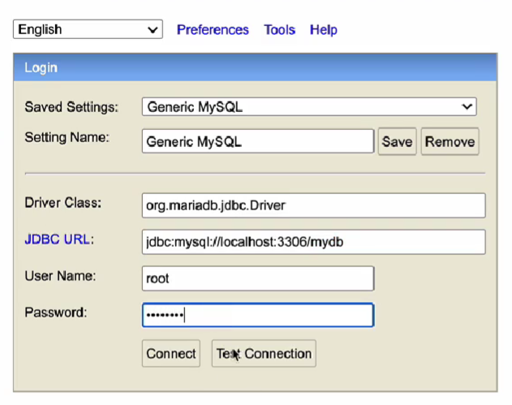

나중에 어디를 고쳤는지 등을 알려면 기록해두는게 필요해서 정리


maven 의존성 추가

```xml
<dependency>
  <groupId>org.mariadb.jdbc</groupId>
  <artifactId>mariadb-java-client</artifactId>
  <version>2.7.2</version>
</dependency>
```


MYSQL 구동 후 접속

```bash
$ mysql.server start
...
SUCCESS!!

...

$ mysql -uroot -p 
Enter password: 
방금전 변경한 패스워드인 test1357 을 입력한다. 

# 데이터베이스 종류 확인
$ show databases;
...
mydb
...


MySQL [(non)]> drop database mydb;
Query ok, 3 rows affected (0.031 sec)

MySQL [(none)]> create database mydb;
Query OK, 1 row affected (0.004 sec)

MySQL [(none)]> use mydb;
Database changed

MySQL [(none)]> show tables;
Empty set (0.002 sec)


```


application.yml 파일 작성

```yaml
server:
  port: 0

spring:
  application:
    name: order-service
  zipkin:
    base-url: http://localhost:9411
    enabled: true
  sleuth:
    sampler:
      probability: 1.0
  h2:
    console:
      enabled: true
      settings:
        web-allow-others: true
      path: /h2-console
  jpa:
    hibernate:
      ddl-auto: update
  datasource:
    driver-class-name: org.h2.Driver
    url: jdbc:h2:mem:testdb
    username: sa
    password:
#    driver-class-name: org.mariadb.jdbc.Driver
#    url: jdbc:mariadb://localhost:3306/mydb
#    username: root
#    password: test1357

# ...
```


<br>

엄청 크게 중요한 내용은 아니지만, 강의에서 진행하는 내용이기에 나중에 혼동이 올 수도 있어서 기억할때 강하게 기억이 남게끔 캡처를 올려둠.




- Driver Class : org.mariadb.jdbc.Driver
- JDBC URL : jdbc:mysql://localhost:3306/mydb
- User name : root
- Password : test1357


h2 콘솔에서 테이블 생성 sql 입력

```sql
create table users(
  id					int					auto_increment primary_key,
  user_id			varchar(20)	not null,
  pwd					varchar(20) not null,
  name				varchar(20) not null,
  created_at	datetime		default NOW()
);
```


